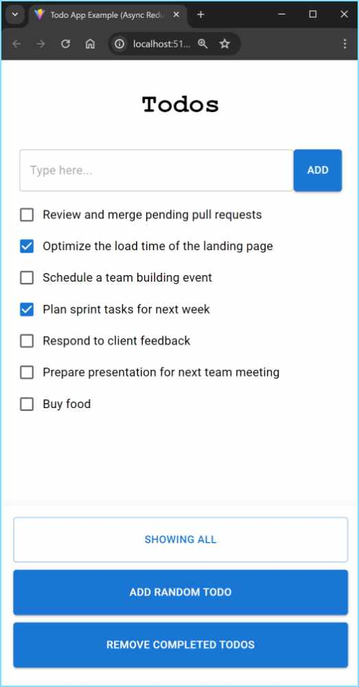

# What is it?

The `todo-app-example` is a Vite + TypeScript + React web page to demonstrate the use of Async
Redux.



## To build and run using IntelliJ

1. Select `Edit Configuration...` in the toolbar.
2. Click the `+` button and select `npm`. A window will open.
3. In `package.json` provide the path to this file:
   `[something]\kiss-for-react\examples\todo-app-example\package.json`
4. In `Command`, select `run`.
5. In `Scripts`, select `dev`.
6. Press the `OK` button to save.
7. In the toolbar, click the green "run" button.

## Note

This project was created following [https://vite.dev/guide](https://vite.dev/guide):

```s
npm create vite@latest todo-app-example -- --template react-ts
```

## Dependency

In it's `package.json` file it adds Kiss as a dependency like this:

```json
{
  "dependencies": {
    "kiss-for-react": "file:../.."
  }
}
```

That's because `todo-app-example` is inside Kiss itself, in the `examples` directory.
If you run it from an independent project, you'll need to include Kiss from npm like this:

```json
{
  "dependencies": {
    "kiss-for-react": "^2.0.0"
  }
}
```

But be sure to use the newest package version.

## Vite configuration

The `vite.config.ts` file has two settings worth knowing about:

* `resolve.dedupe: ['react', 'react-dom']` is only needed here, because Kiss is linked from the
  repository root, which has its own copy of React. Without it, the app would load two copies of
  React and the hooks would fail.

* `build.rolldownOptions.output.keepNames: true` is needed in **any** project that uses Kiss's
  `ClassPersistor`, because it saves and restores the state using the class names. Without it,
  the production build minifies the class names, and the persisted state can't be restored.

## Importing

To import Kiss from `todo-app-example`:

```ts
import {Store, KissAction} from 'kiss-for-react';
```
